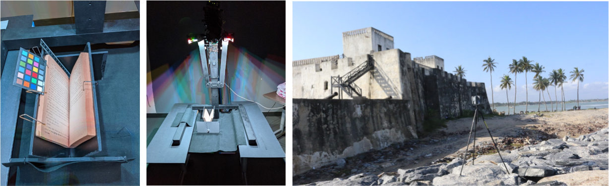

Art and culture, at their best, lie in the act of discovery: seeing what is hidden and rejecting the fallacy that what we see is all there is. Almost every great piece of art, artifact, or site has something hidden within it, invisible to the naked eye. Paintings have pentimenti — those rough drafts that the artist regrets and paints over; manuscripts have palimpsests or scratch-outs — text that is covered up or overwritten; and buildings and archeological sites are a world of unexpected labyrinths. Discovery is central to culture and art but is under-supported technology-wise.
We develop photogrammetry, 3D imaging, visualization, and machine learning systems to enable knowledge discovery in art, history, and culture.
Our tools allow for user-centric exploration in both casual consumption and scientific research of cultural heritage.

## Related Publications

:::{#pubs}
:::
