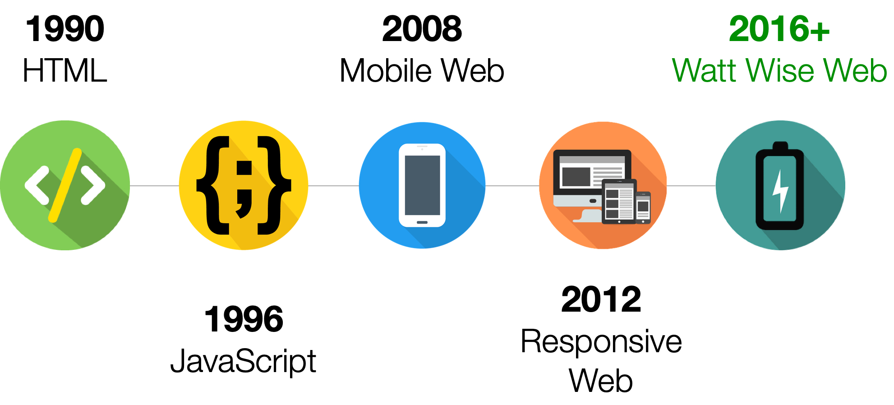

The Web has fundamentally shaped how we think, communicate, and innovate. Web 1.0 provided means to retrieve information that would have never been reachable. Web 2.0 aimed to connect millions of users that would have never been connected. Now the Web is once again on the cusp of a new evolution, driven by the need to connect billions of devices and to provide intelligent, personalized services.
We work on enabling the next-generation Web computing in two ways. First, we provide new abstractions for mobile systems to enable holistic optimizations that span the application, language, Web browser runtime, and processor architecture layers. Second, we build cloud systems to support event-driven execution model coupled with managed scripting languages, essential to improve the scalability, developer productivity, and service portability of future cloud services.

## Related Publications

:::{#pubs}
:::
