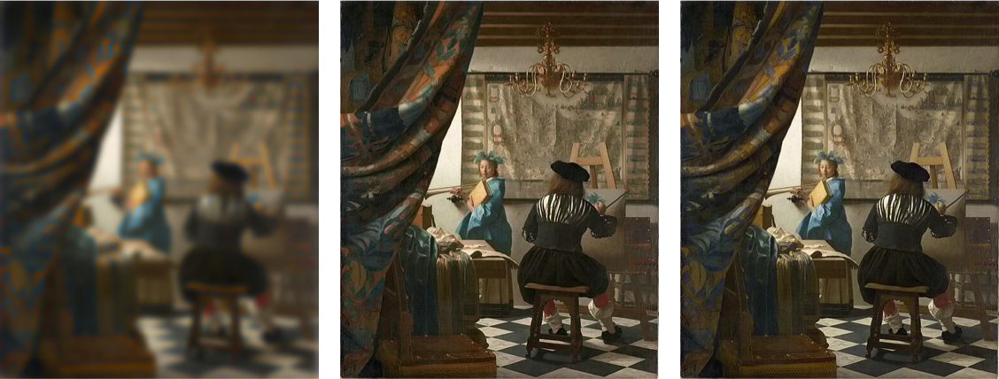

::: {style="font-size: 0.8em;"}
We take *[The Art of Painting](https://en.wikipedia.org/wiki/The_Art_of_Painting)* from Johannes Vermeer, decouple it into three channels: luminance, red-green, and blue-yellow. We then spatially blur one of the channels while keeping the other two channels unchanged and then reconstruct the image. Our vision is much more sensitive to spatially blurring in the luminance channel (left) than is to blurring in the red-green channel (middle) and in the blue-yellow channel (left).
Interestingly, this also shows that the Magnocellular pathway, while is said to be responsible for the dark-light opponent cells, cannot alone be exclusively responsible for our luminance perception.
:::

We live in and experience an immense world.
A big part of our experience is made possible through our visual system: the eyes, the retina, and the brain.
Understanding the human visual system (HVS) is important at two levels.
First and foremost, for the science itself --- for the [pleasure of finding things out](https://www.google.com/books/edition/The_Pleasure_of_Finding_Things_Out/s6LzV_U6PskC?hl=en&gbpv=0).
As Edwin H. Land once put it, the true application of science is that “we finally know what we are doing.”
Second, many visual computing systems (such as smartphones, AR glasses, and VR headsets) generate images that are ultimately consumed by humans, so understanding how the HVS processes and interprets these signals allows us to better engineer such systems.

## Related Publications

:::{#pubs}
:::
