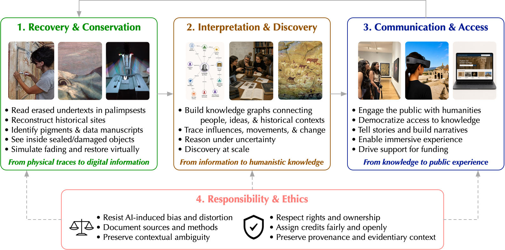

Like virtually every other field, the humanities have been profoundly transformed by technologies.
Digital humanities as a broad scholarly enterprise emerged during the 2000s, when large-scale digitization initiatives, dedicated funding, and shared infrastructure transformed the field.

We are once again at the cusp of a new phase: the *computational humanities*.
The transition from digitization to computation is profound.
The focus is no longer just to digitize artifacts, but to computationally analyze, and to gain knowledge from, the artifacts --- through advances in computer vision, graphics, imaging, and artificial intelligence (AI).
Computational humanities offer the computing community not only impactful research problems and compelling motivations for developing new computational methods, but also intellectual interlocutors that challenge, refine, and expand the questions that computation can address.

## Related Publications

:::{#pubs}
:::
