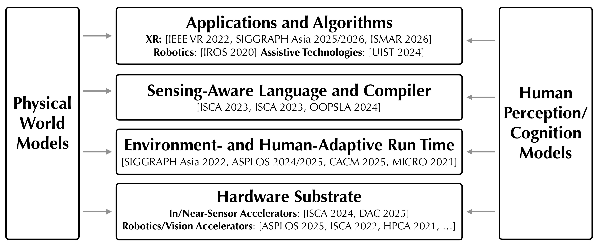

Two characteristics of emerging applications such as extended reality (XR), embodied/physical AI, and autonomous agents are reshaping the foundations of computer systems design:

- First, computing systems will increasingly sense and interpret the physical world, pushing computation beyond digital processors into optics, sensors, and analog circuits.
- Second, computing systems increasingly interact, and collaborate, closely with humans. Human perception and cognition impose constraints on system design while also revealing opportunities to reduce computation, communication, and energy consumption.

We address these challenges by co-designing programming languages, run-time systems, and hardware architectures.
Critically, we build and translate models of the physical world and human perception/cognition into principled abstractions, and use these new abstractions to design software and hardware techniques across the physical-to-digital stack.

## Related Publications

:::{#pubs}
:::
