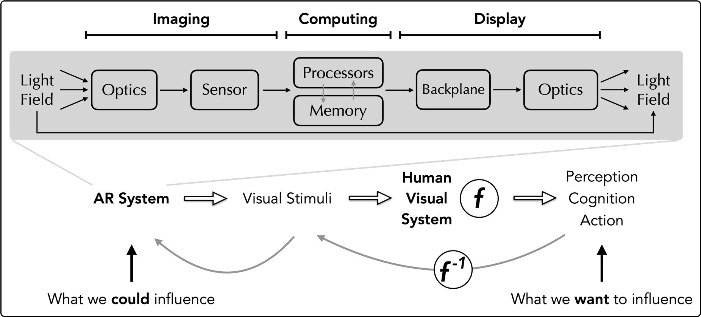

Visual computing systems have to simultaneously: 1) *capture* massive amount of visual data (through image sensors), 2) *interpret* the visual data to provide intelligent services to us (through computer vision algorithms running on hardware silicon), and 3) *generate* visual data from the display that ultimately interacts with our visual system (eye, retina, and brain).
Our work holistically designs and optimizes across the entire visual computing pipeline, spanning imaging optics, sensors, computer systems, displays, and the human visual systems.
Ultimately, the goal is to deliver an immersive experience to human observers under a usually tight power and energy budget while protecting user privacy.

## Related Publications

:::{#pubs}
:::
